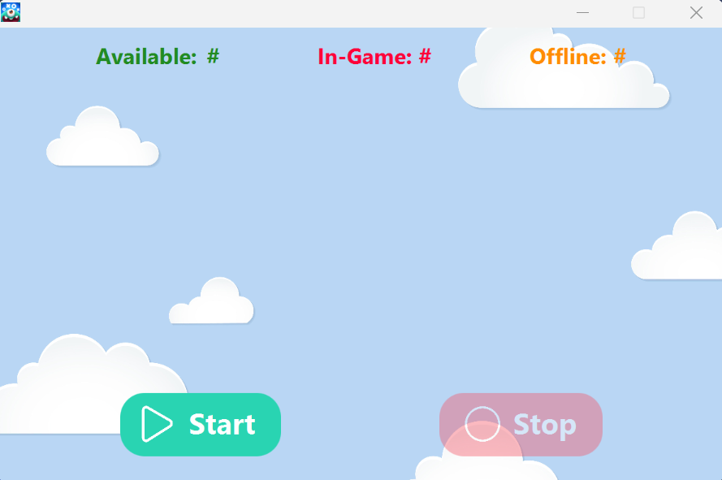
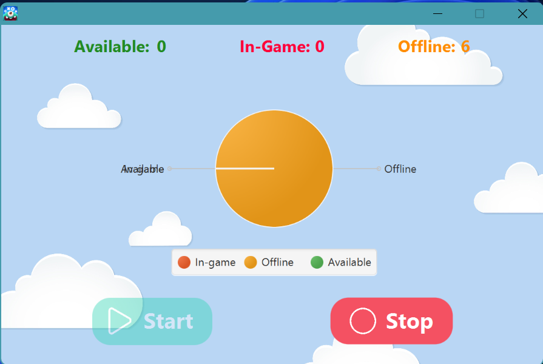
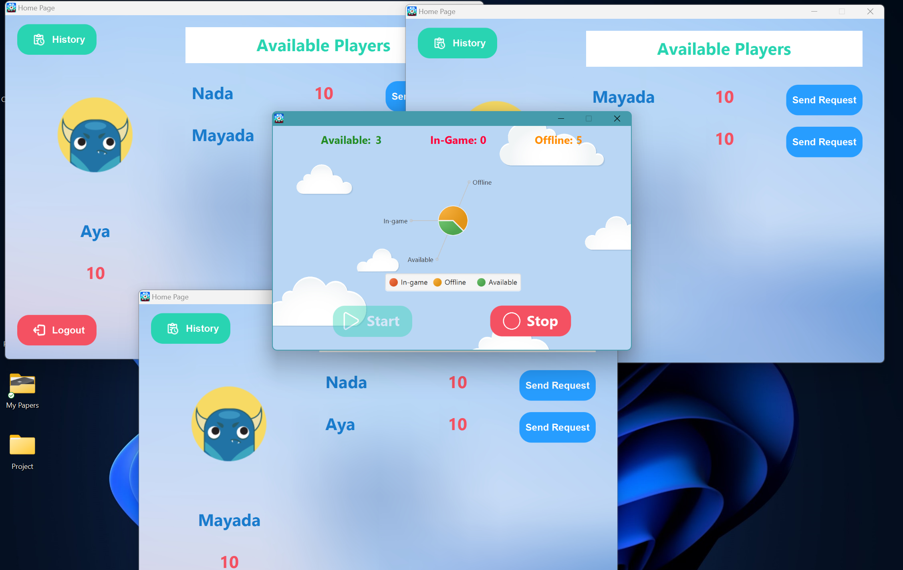
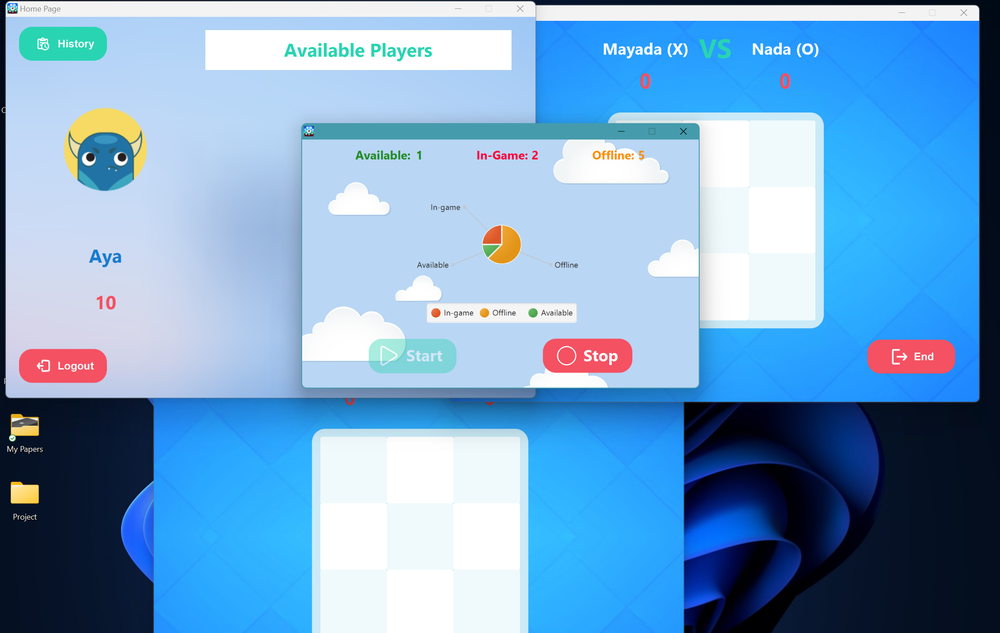
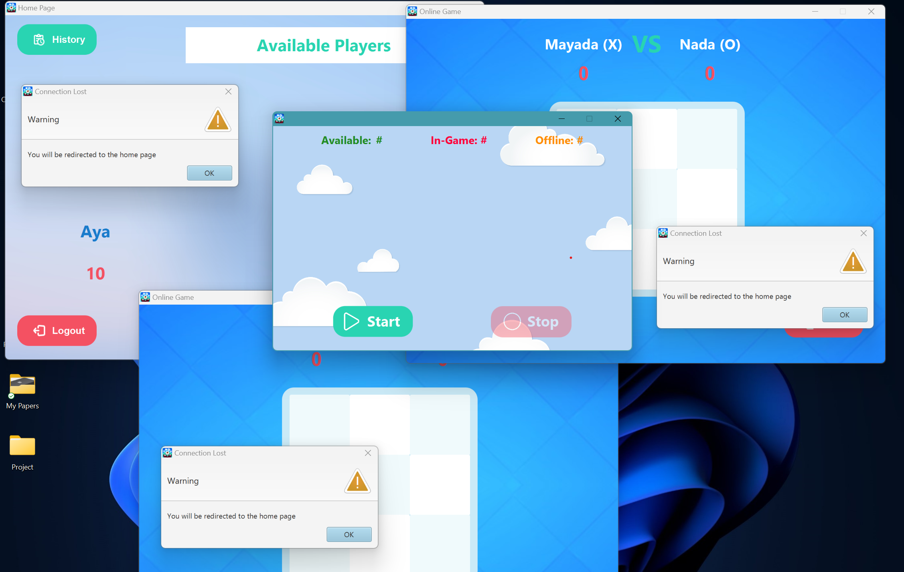

## Overview

The server application is a crucial part of Monster tic-tac-terror. It manages user authentication, database transactions, and real-time communication between players.


## Features

- **User Management:**
  - Register and login functionality.
  - Stores player scores in the database.
- **Game Management:**
  - Handles game sessions for online matches.
  - Records game data for replay functionality.
- **Monitoring:**
  - Simple GUI with Start/Stop buttons.
  - Displays graphs showing available, in-game, and offline users.


## Requirements

- **Java Version:** Java 8
- **Database:** Apache Derby DBMS.
- **Libraries:**
  - JDBC for database interaction.
  - JSON simple 1.1.1 library for server and client interaction and saving and replaying records.


## Setup Instructions

### Step 1: Clone the Repository

```bash
git clone https://github.com/Mayada-Elsayed-Mostafa/TicTacToeGameITIServer.git
cd server
```

### Step 2: Configure the Database

1. Create an Apache Derby Database Schema of one table (PLAYER) which has four columns (USERNAME, PASSWORD, STATUS, TOTAL_SCORE). An image of it is below.
   // MAYADA: Add an image of the table
2. Update the database connection details in the server configuration file.

### Step 3: Build and Run the Server

1. Compile the server application:
   ```bash
   javac -d bin src/*.java
   ```
2. Run the server:
   ```bash
   java -cp bin ServerMain
   ```


## Usage

1. Click on the Start button using the GUI to start the server.
2. Monitor available/in-game/offline users and active game sessions.
3. Stop the server using the Stop button once all sessions are completed.

## Screenshots

Here are some screenshots to showcase the application's features:

## 1. Control Page



## 2. In Game Mode





## Contributors

1. [Mayada Elsayed](https://github.com/Mayada-Elsayed-Mostafa)
2. [Hazem Mahmoud](https://github.com/Hazem-web)
3. [Shereen Mohamed](https://github.com/shereenmohamed923)
4. [Aya Elsayed](https://github.com/aya-emam-0)
5. [Khairy Hatem](https://github.com/KhairySuleiman4)


## License
This project does not currently have a license. Please contact the contributors for permissions.
